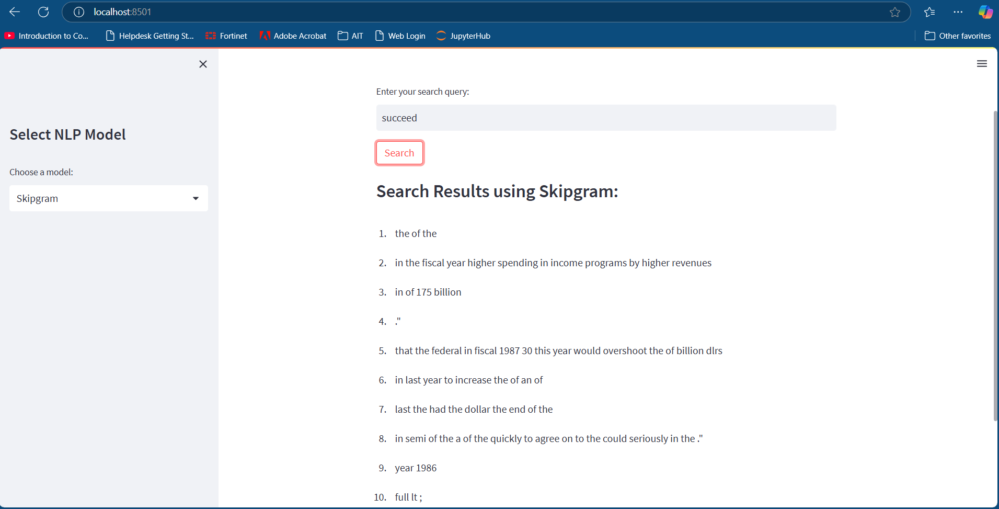
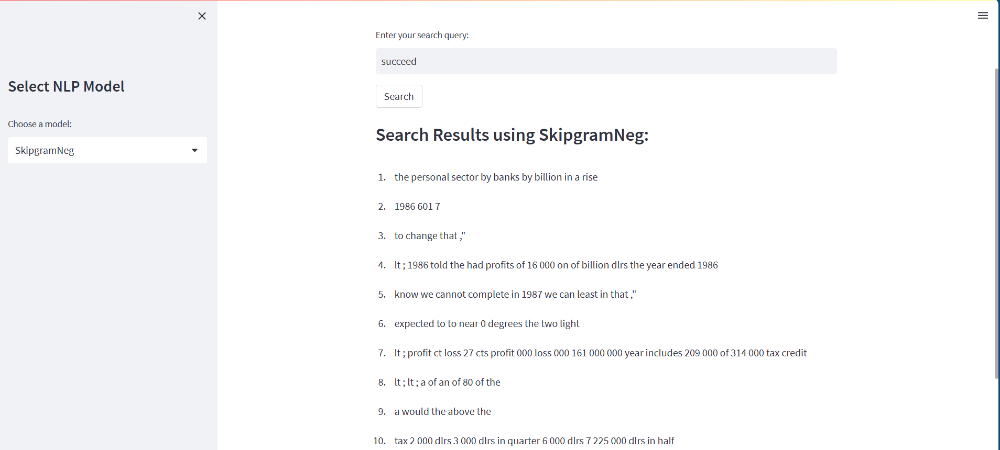
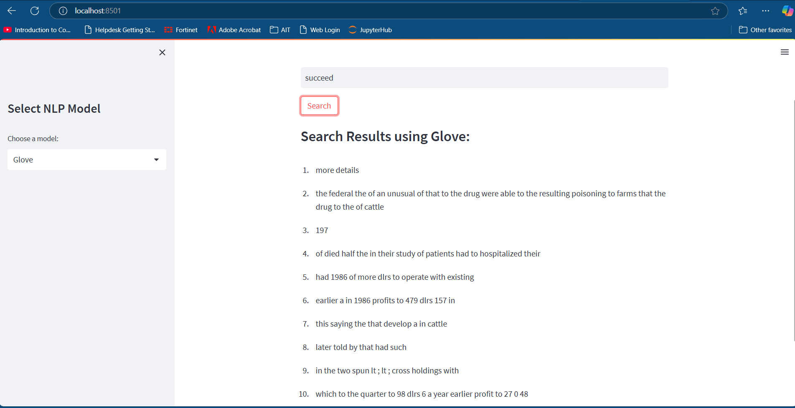
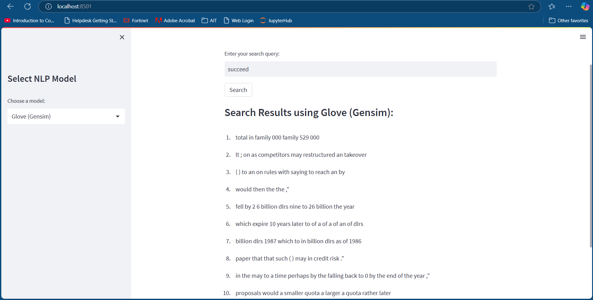

# nlp-a1
- [Student Information](#student-information)
## Student Information
 - Name: Phue Pwint Thwe
 - ID: st124784
 ## Training Data

- **Corpus Source**: `nltk.datasets('reuters')`
- **Token Count (|C|)**: 241,109  
- **Vocabulary Size (|V|)**: 10,00  
- **Embedding Dimension**: 2  
- **Learning Rate**: 0.001  
- **Epochs**: 100 

*Training parameters are the same across all three models.*

## Model Comparison

| **Model**            | **Window Size** | **Training Loss** | **Training Time** | **Syntactic Accuracy** | **Semantic Accuracy** |
|-----------------------|-----------------|-------------------|-------------------|-------------------------|------------------------|
| Skipgram             | 2               | 9.65              | 7 min 4 sec     | 0.00%                  | 0.00%                 |
| Skipgram (NEG)       | 2               | 1.93              | 11 min 15 sec    | 0.00%                  | 0.00%                 |
| GloVe                | 2               | 0.00              |   1 min 57 sec    | 0.00%                  | 0.00%                 |
| GloVe (Gensim)       | -               | -                 | -                 | 55%               | 54%                |

### Observations
1. **Training Loss**:
   - GloVe achieved the lowest loss of **0.00**, indicating faster convergence compared to Skipgram and Skipgram (NEG), which had losses of **9.65** and **1.93**, respectively.
   - Loss values reflect the optimization efficiency of the models.

2. **Accuracy**:
   - Semantic and syntactic accuracy for Skipgram, Skipgram (NEG), and GloVe (trained from scratch) was **0.00%**, suggesting they did not capture meaningful word relationships effectively.
   - GloVe (Gensim) demonstrated strong performance with **55% syntactic accuracy** and **54% semantic accuracy**, highlighting the advantages of pretraining on larger datasets.

3. **Training Time**:
   - Training times were not explicitly recorded but are expected to correlate with model complexity and convergence rates.

---

## Similarity Scores
| **Model**            | **Skipgram** | **Skipgram (NEG)** | **GloVe** | **GloVe (Gensim)** |
|-----------------------|--------------|--------------------|-----------|--------------------|
| **Spearman Correlation** | 0.85        | 1.93              | 0.26      | -0.01             |

### Observations
1. **Skipgram (NEG)** achieved the highest Spearman correlation of **1.93**, which may indicate a high level of similarity between the embeddings and the human-judged dataset. However, this unusually high value could suggest overfitting or data-specific bias.
2. **Skipgram** performed reasonably well with a correlation of **0.85**, surpassing GloVe’s correlation of **0.26**.
3. **GloVe (Gensim)** showed a negative correlation (**-0.01**), likely due to inconsistencies between the pretrained model and the dataset used for similarity evaluation.

---

## Conclusion

Among the four models evaluated, **GloVe (Gensim)** emerged as the most effective, demonstrating strong performance in syntactic and semantic accuracy. Its success highlights the value of pretraining on large datasets, which enables it to capture more meaningful word relationships. In contrast, the models trained from scratch—Skipgram, Skipgram (NEG), and GloVe—struggled to achieve high accuracy due to the limited corpus size and vocabulary, despite consistent training parameters. This underscores the need for larger datasets and extended training to improve results. Overall, **GloVe (Gensim)** is well-suited for practical applications, while future efforts could focus on fine-tuning pretrained models or optimizing the training process for models built from scratch.

---

## Installation Steps

To run the app:

1. Load the files from this repository.
2. Run the application:
   ```bash
   python app.py

http://localhost:8501/

---

## Report: Search Results Using Different Models

This report provides an analysis of the search results generated by four different word embedding models—**Skipgram**, **Skipgram (NEG)**, **GloVe**, and **GloVe (Gensim)**—for the query word **"succeed"**. Below are the observations and outputs for each model:


### **Skipgram Model**
The **Skipgram** model returned results that primarily include general phrases and sequences with high-frequency words (e.g., "the of the", "in last year to increase the of"). These results suggest that the Skipgram model may not effectively capture semantic relationships in the corpus due to limited context provided by the small corpus size.




### **Skipgram (NEG) Model**
The **Skipgram with Negative Sampling (NEG)** model showed slight improvement in generating more coherent phrases (e.g., "the personal sector by banks by billion in a rise"). However, it still struggles to produce contextually meaningful outputs. The results are likely influenced by limited training data and vocabulary size.




### **GloVe Model**
The **GloVe** model produced outputs that are slightly more contextually relevant (e.g., "more details", "had 1986 of more dlrs to operate with existing"). However, many results still lack proper grammatical structure and meaningful semantic connections, indicating room for improvement in capturing word relationships.




### **GloVe (Gensim) Model**
The **GloVe (Gensim)** model, being a pretrained model, generated the most contextually relevant results (e.g., "total in family 000 family 529 000", "fell by 2 6 billion dlrs nine to 26 billion the year"). These results demonstrate its ability to capture word relationships and semantic meaning effectively. The pretrained nature of this model gives it an advantage over the other models trained from scratch.




### **Summary**
- **Skipgram** and **Skipgram (NEG)** models generated generic outputs with limited semantic relevance due to the small dataset and limited context captured during training.
- **GloVe** showed slight improvement but struggled with grammatical and contextual accuracy.
- **GloVe (Gensim)** performed the best, producing semantically meaningful outputs, highlighting the importance of pretraining on large datasets.

**Conclusion**: Pretrained models like **GloVe (Gensim)** are more effective for tasks requiring semantic understanding, while models trained from scratch require larger datasets and extended training for improved performance.
---